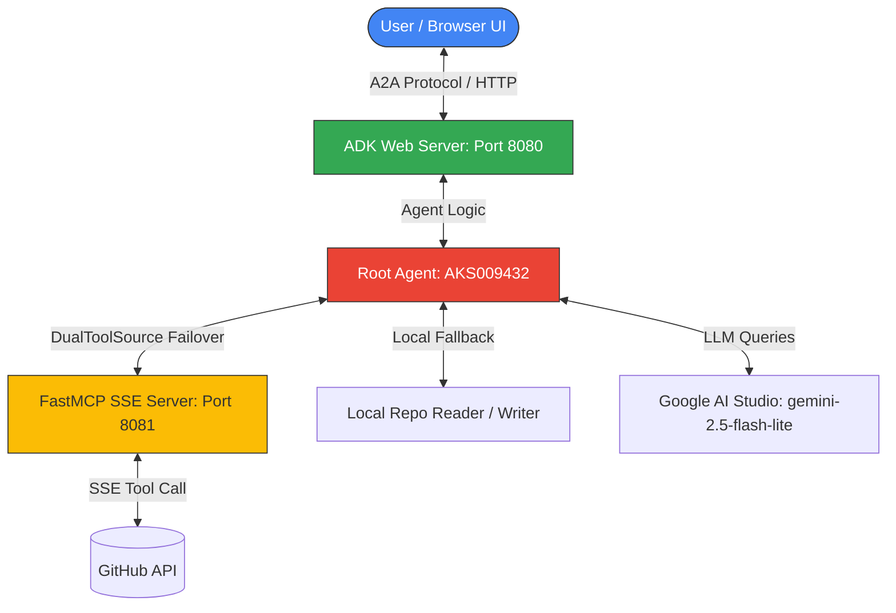

# Vibe-to-Spec Agent
> **The Enterprise-Grade Agent Auditor: bridging the gap between natural language vibe-coding and robust, production-ready specifications.**

---

## What It Does
The **Vibe-to-Spec Agent** analyzes vibe-coded agent codebases and automatically generates structural, behavioral, and security reviews. It operates in two core execution modes:

1. **Quick Scan**: Triggered by pasting a GitHub repository URL directly. The agent scans the code and writes a rapid findings report to `audit_reports/quick_scan/`.
2. **Deep Audit**: Triggered by explicit intent or text prompts. The agent leads a 5-question human-in-the-loop interactive interview to align the builder's goal, audience, success metrics, and known gaps. It then saves three detailed files to `audit_reports/deep_audit/`:
   * `SPEC.md`: The living specification mapping intent to implementation.
   * `GAP_REPORT.md`: Security analysis (permissions, sandboxing, dependencies, observability) with risk tiers.
   * `EVAL_RUBRIC.md`: An evaluation rubric with test cases and trajectory assertions.

---

## Course Concepts Demonstrated
* **Agent Development Kit (ADK)**: Uses ADK's `A2aAgent` framework and dynamic execution loop for local playground hosting, interactive UI widgets, and telemetry.
* **Model Context Protocol (MCP)**: Exposes a standalone, SSE-based FastMCP server (`app/mcp_server.py`) hosting the `read_github_repo` tool on port `8081`.
* **Dynamic Failover (DualToolSource)**: Implements custom `DualToolSource` logic. The agent automatically connects to the running MCP server first, but dynamically falls back to local execution if the MCP server is offline.
* **Antigravity CLI**: Custom telemetry configuration pushing agent identity (`AKS009432@1`) in trace events, providing a professional enterprise audit log.
* **Security & Auth Routing**: Audits codebases for file execution capabilities, credential exposure, and sandbox violations. Implements patched auth routing (`google.auth.default = (None, None)`) to resolve Vertex/GCP token override errors.
* **Agent Skills**: Demonstrates split-turn human-in-the-loop execution, sequential tool calling constraints, and structured markdown output generation.
* **Deployability**: Ready for instant local execution or GCP containerization using the standard `agents-cli deploy` tool.

---

## Quick Start
```cmd
git clone https://github.com/AKS009432/vibe-to-spec-agent
cd vibe-to-spec-agent
set GOOGLE_API_KEY=your_ai_studio_key
set GITHUB_TOKEN=your_github_token
set GEMINI_MODEL=gemini-2.5-flash-lite
start.bat
```
Then open: http://127.0.0.1:8080/dev-ui/?app=app

---

## Full Documentation
For advanced setup options (including OpenAI fallbacks, service accounts, and API troubleshooting), view the [USAGE.md](./USAGE.md) manual.

---

## Architecture Diagram


---

## Track
**Freestyle**
