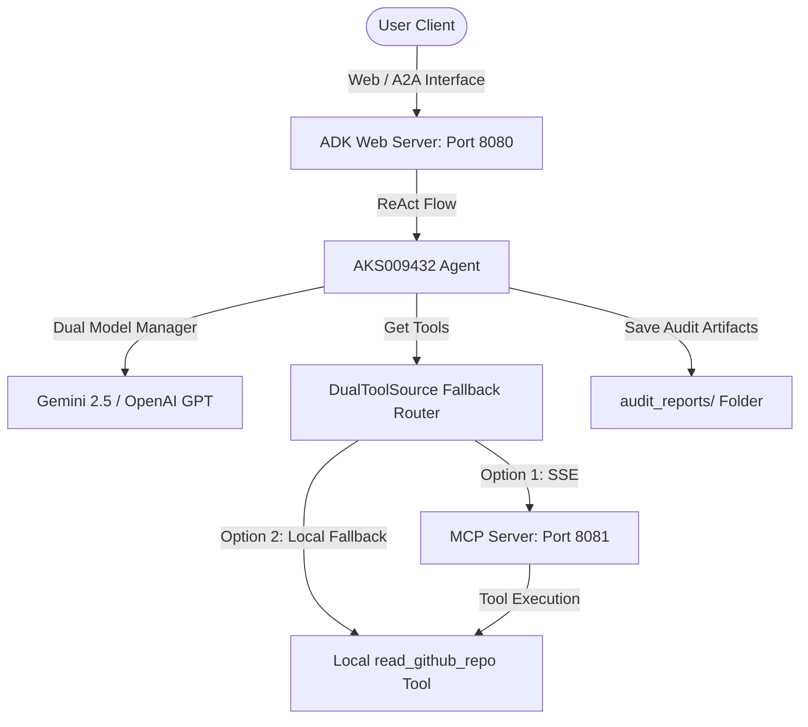

# vibe-to-spec-agent Instruction Manual

An enterprise-grade tool for auditing vibe-coded agents, generating living specifications, performing 7-pillar security analyses, and producing test cases and execution trajectories.

---

## Prerequisites

Before running the agent or starting the servers, ensure your machine satisfies the following requirements:
* **Python**: Python `>=3.11` and `<3.14`
* **uv**: Astral's package manager ([Installation Guide](https://docs.astral.sh/uv/getting-started/installation/))
* **Node.js**: Node.js v18+ (needed for MCP tools and A2A inspector validation)
* **Git**: Git CLI installed and configured in your path (needed for GitHub cloning/tool actions)

---

## Environment Setup

Configure your terminal session using one of the two supported models.

### Option A — Google Gemini (Recommended)
This uses the official Google GenAI SDK to call Gemini models:
```cmd
set GOOGLE_API_KEY=your_ai_studio_key
set GITHUB_TOKEN=your_github_token
:: Optional: Override default model (useful if hitting free-tier 429 limits)
set GEMINI_MODEL=gemini-2.5-flash-lite
```

### Option B — OpenAI Fallback
This uses LiteLLM to call OpenAI models:
```cmd
set OPENAI_API_KEY=your_openai_key
set GITHUB_TOKEN=your_github_token
```

> [!NOTE]
> Free-tier API keys often encounter `429 RESOURCE_EXHAUSTED` errors when auditing larger repositories due to Input Tokens Per Minute (TPM) limits. Setting `GEMINI_MODEL=gemini-2.5-flash-lite` lowers token consumption thresholds and resolves these limits.

---

## Starting the Agent

Launch the server suite with a single command:
```cmd
start.bat
```
This script starts:
1. The **MCP Server** in the background on port `8081`.
2. The **ADK Web Server** in the foreground on port `8080`.

Open your browser to:
**[http://127.0.0.1:8080/dev-ui/?app=app](http://127.0.0.1:8080/dev-ui/?app=app)**

---

## How to Use

The agent operates in two distinct modes depending on your input.

### Mode 1 — Quick Scan
* **Trigger**: Paste any public GitHub URL directly into the chat prompt.
* **Example**:
  ```text
  https://github.com/google-gemini/gemini-api-cookbook
  ```
* **Output**: Writes a findings report to:
  `audit_reports/quick_scan/{repo}_{date}_scan.md`

### Mode 2 — Deep Audit
* **Trigger**: Prefix your message with `"deep audit:"` or `"deep scan:"`.
* **Example**:
  ```text
  deep audit: https://github.com/google-gemini/gemini-api-cookbook
  ```
* **Process**:
  1. The agent will read the repository files.
  2. The agent will prompt you with **5 targeted questions (A1-A5)** about your architectural intent.
  3. Respond to the questions in the chat.
  4. The agent will perform a security check and generate the following three files under `audit_reports/deep_audit/`:
     * `{repo}_{date}_spec.md` (Living Specification)
     * `{repo}_{date}_gap_report.md` (7-Pillar Security Gap Analysis)
     * `{repo}_{date}_eval_rubric.md` (Evaluation Rubric & Trajectories)

---

## MCP Server

The standalone Model Context Protocol (MCP) server runs automatically on **port 8081** via `start.bat`.
* It exposes the `read_github_repo` tool as an MCP endpoint.
* If the MCP server is shut down or offline, the agent gracefully falls back to the local tool execution method so audits remain operational.

---

## Output Files Reference

| File | Mode | Contents |
| :--- | :--- | :--- |
| `quick_scan/*_scan.md` | Mode 1 | Categorized vulnerabilities (`CRITICAL` / `HIGH` / `MEDIUM` / `LOW`) containing plain-English explanations, real-world exploit scenarios, and exact file paths with line-level evidence. |
| `deep_audit/*_spec.md` | Mode 2 | The living functional specification of the agent, mapping intended behaviors against code reality. |
| `deep_audit/*_gap_report.md` | Mode 2 | In-depth security analysis assessing permissions, sandboxing, dependencies, data flow, logging, and human-in-the-loop gates. |
| `deep_audit/*_eval_rubric.md` | Mode 2 | Rigorous test cases, step-by-step reasoning trajectories, and a final alignment grading verdict. |

---

## Running Tests

Execute the unit and integration test suite to verify code health:
```bash
uv run pytest tests/unit tests/integration
```

---

## Architecture Overview



* **ADK 2.0 ReAct Agent**: The agent uses the ReAct (Reasoning and Acting) loop to dynamically select tools, interview builders, and structure output reports.
* **MCP Server**: Runs as an independent process on port `8081`. Standardizes tool execution and exposes repo reading capabilities globally.
* **Dual Model Support**: Detects `GOOGLE_API_KEY` (Gemini) or `OPENAI_API_KEY` (OpenAI via LiteLLM) dynamically at runtime.
* **audit_reports/ Structure**: Reports are written locally to the workspace under structured directories separating quick scans and deep audits.
